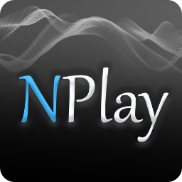
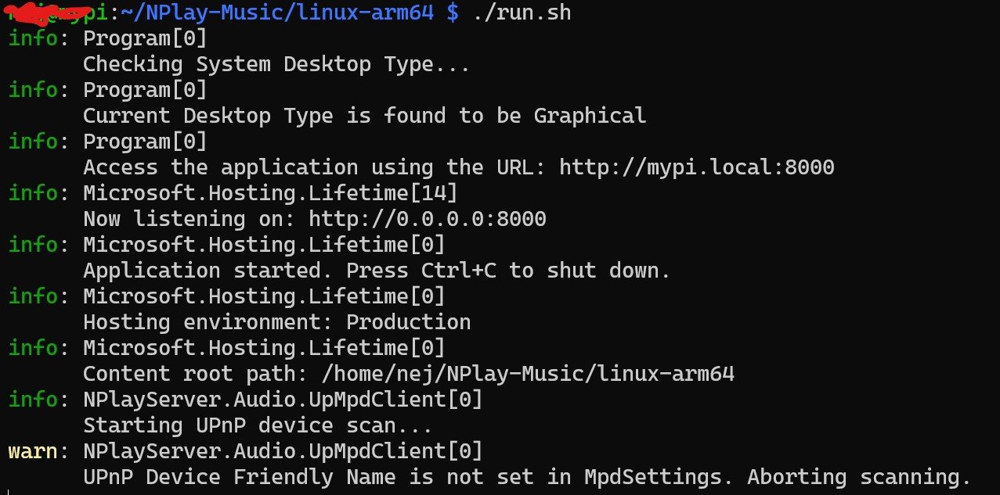
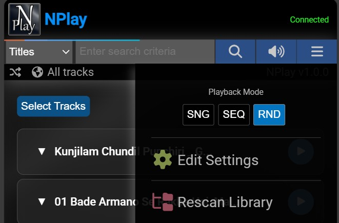
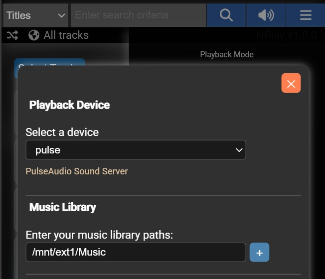
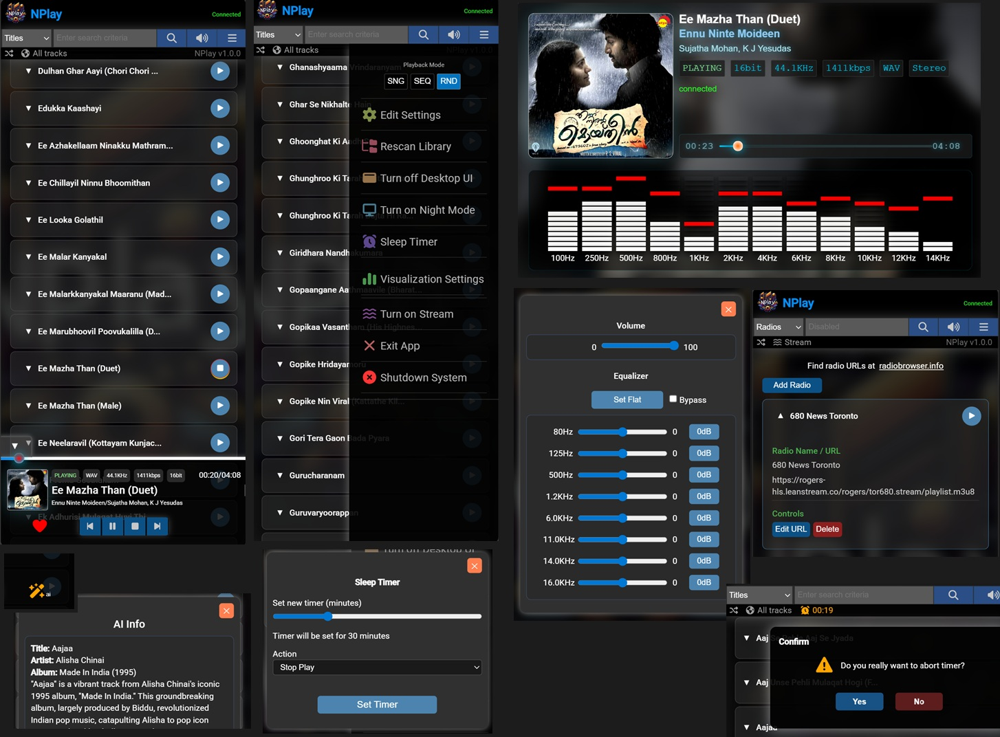

# NPlay Music Player and Streamer

</img>




NPlay is a remote-controllable lightweight music player and streamer designed for Raspberry Pi and Linux platforms with simplicity and ease of use in mind. It supports prominent audio formats and provides a user-friendly interface for managing and playing your music collection.  It also includes streaming capabilities, allowing you to play music from online sources such as webradios and Qobuz.

## Features
- Supports audio formats WAV, FLAC, and MP3.
- Supports 16-bit, 24-bit, and 32-bit audio files.
- Web radios and online streams (integration via Music Player Demon - MPD).
- Full remote control via web interface - you can control playback and DSP effects from any device with a web browser.
- Can be run as headless server or with local desktop UI.
- A local desktop display user interface, especially useful on devices with small screens such as Raspberry Pi to run visualization effects in full-screen mode.
- Ask AI feature to get track information of currently playing song using Google Gemini AI (requires Google account and free API key - see documentation for setup instructions).
- Supports Qobuz streaming control, visualization, and DSP via MPD and UpMpdCli (requires Qobuz account) - see documentation for setup instructions.
- Library management with support for multiple music directories.
- Playlist management (create/delete playlists, add tracks to playlists, etc.).
- Playback controls (play, pause, stop, next, previous, seek).
- Edit track metadata tags (title, artist, album, etc.) for individual tracks.
- Temporary queue for adding songs to be played next.
- Random, sequential, and single playback modes.
- Album art and track metadata display.
- Adaptive background display for desktop UI based on album art.
- Add track to favorites functionality - saved as Favorites playlist.
- Library browsing and searching (supports searching by title, file name, folder, artist, album, format, etc.).
- Deferred loading of tracks and infinite track scrolling.
- Parametric equalizer with (number of bands configurable).
- A 12-band, 15-level spectrum analyzer visualization with configurable color schemes, peak hold, and falloff settings.
- Support for selecting audio output devices (sound cards/USB DACs, etc.)
- Bypassable DSP effects (equalizer, bass boost, etc.) - for bit-perfect audio output
- In-built software volume control.
- Night mode for distraction-free listening in low-light environments.
- Sleep timer with auto stop, auto system shutdown, night mode activation etc.
- Exposes REST API for all features.
- Websockets for realtime updates to connected clients.


## Installation
- Download this repository package and unzip the v1.0.0 directory it to your home directory to path **~/NPlay-Music**.  This package has precompiled binaries for Raspberry Pi (linux-arm64 directory) and desktop Linux computers with Intel processors (linux-x64 directory).
- Open a terminal window and navigate to the correct directory based on your system architecture.  While in the directory, change the permissions of _install.sh_ file to executable:
    ```sh
    sudo chmod +x install.sh
    ```
- Run the installation script:
    ```sh
    sudo ./install.sh
    ```
- After installation is complete, follow the on-screen instructions to run NPlay. It mainly involves running the command:
    ```sh
    ./run.sh
    ```
- After starting NPlay, open a web browser from the same device or another device on the network and navigate to `http://<your-device-ip>:8000` `http://<your-device-hostname>:8000` to access the web interface.  Replace `<your-device-ip>` or `<your-device-hostname>` with the actual IP address or hostname of your Raspberry Pi or Linux computer.

    Screenshot for reference:
    

## Initial Setup
- **Adding music collection:** Upon first run, you will see a blank listing page on the main screen.  To add music files to your library, click on the menu icon (3 bars at the top right corner), click "Edit Settings", which brings up a screen where you can add paths to your music directories. For example, if you have your music collection on a USB drive, add the path to that drive. After adding the paths, click on "Save". From the menu, click on "Rescan Library" button to start the scanning process. This process will scan your library and create a catalog of the tracks in cache file.  Note that, the scanning may take some time depending upon the size of your music collection (you can see a loading bar at the top of the screen until scanning is complete).  After scanning is complete, try refreshing the page and you should see your music files listed in the main screen.
- **Audio Output Device:** By default, the system will use the default audio output device (named "default"). If you have multiple audio output devices (sound cards, USB DACs, etc.) connected to your system, you can select the desired output device from the "Select a device" dropdown in the Settings screen.  Tip: Certain devices with names starting with "hw" may produce garbled audio if the sample rates do not match.  In such cases, try selecting the "plughw" version of the same device available in the dropdown.  If you have PulseAudio or Pipewire installed, the "default" may be referring to PulseAudio/Pipewire, which usually handles most of the mismatch issues.
- **Adding web radios:** To add web radios, go to the Radios option from the dropdown on the main toolbar and click on the "Add Radio" button.  Enter the name and streaming URL of the web radio station you want to add.  You can find web radio URLs at [radio-browser.info](https://www.radio-browser.info).
- **Using DSP Effects:** By default, DSP effects such as equalizer are enabled with defaults. To adjust DSP effects, go to the Speaker icon on the main toolbar and adjust the settings.

Please reer to the following screenshots for reference:
- Edit Settings and Rescan menu options:

- Adding music directories and selecting audio output device:



## More Screenshots
Screenshot of major components of NPlay web and desktop interface:


## Demo
A short video demo of the desktop interface: [Video Demo](https://youtube.com/shorts/H0bP7UC9IRQ?si=vdpuR8H5PjrMmPex)

## Web Radio Streaming Integration
NPlay supports integration with online streaming services via Music Player Daemon. The install script automatically installs MPD if it is not already present on your system. You can add your favorite web radios under the Radios option. Web radio URLs can be found at [radio-browser.info](https://www.radio-browser.info). 
    
## Qobuz Streaming Integration
Qobuz is a high-quality music streaming service that offers streaming at CD quality and above.  NPlay supports integration with via Music Player Daemon (MPD) and UpMpdCli. The install script automatically installs MPD and UpMpdCli if they are not already present on your system. For detailed setup instructions, please refer to the [Qobuz Integration Documentation](qobuz-setup.md).

## License
You can use this software free of charge. For licensing details - see the [LICENSE](LICENSE.txt) file
